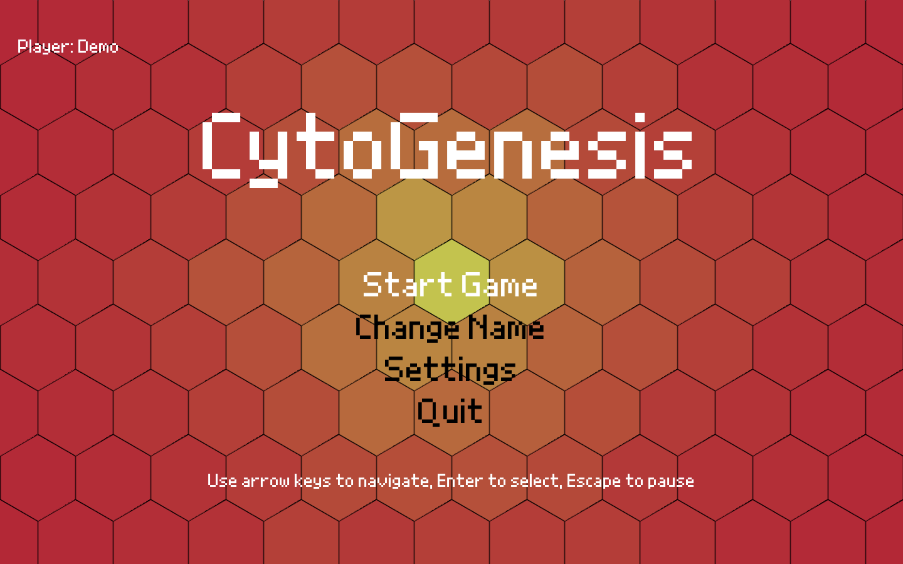
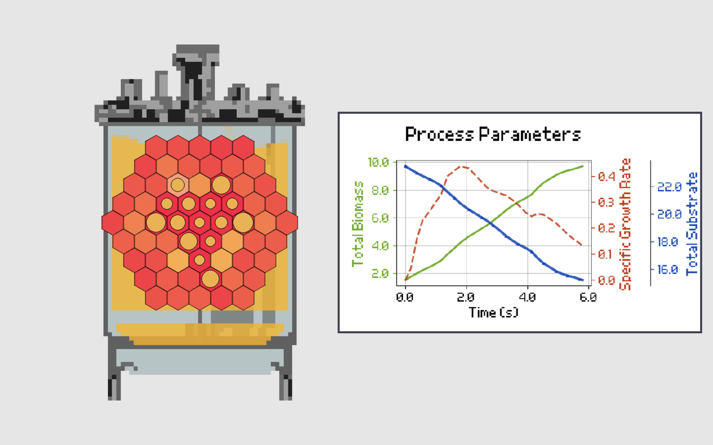
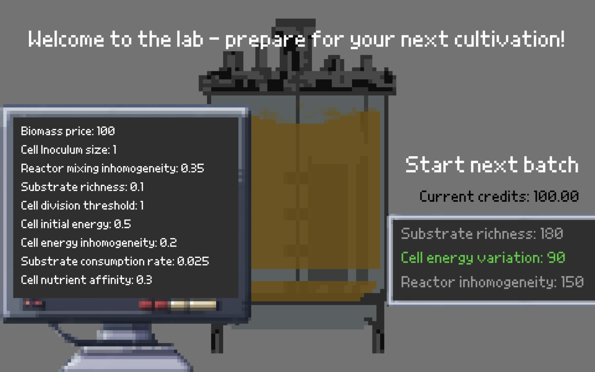
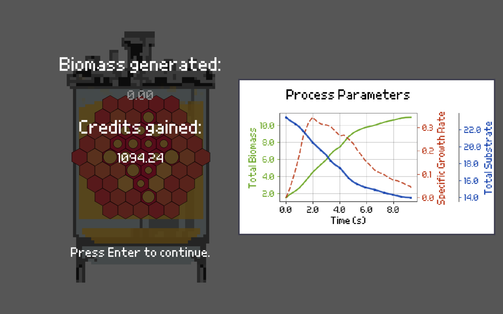
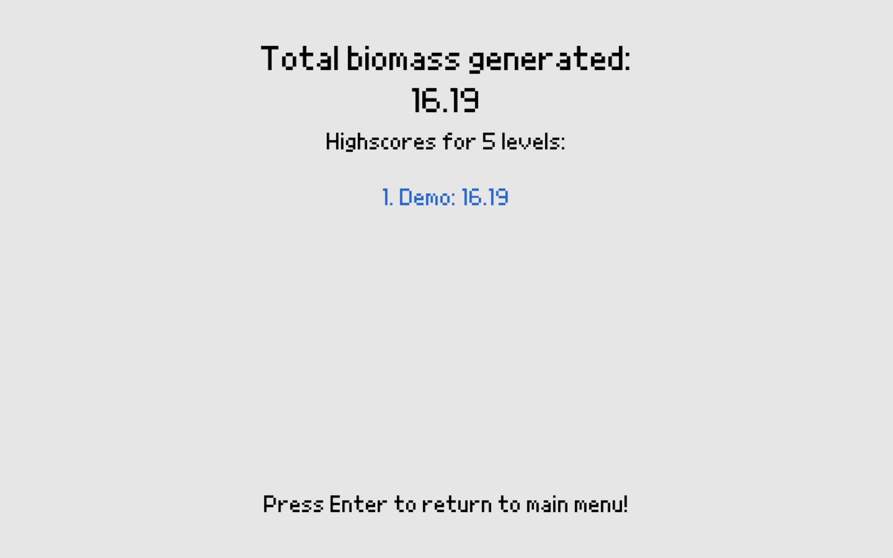

# CytoGenesis - A Bioprocess Engineering Game

[](https://www.python.org/)
[](https://www.pygame.org/)

CytoGenesis is a educational game focused on cellular biology and bioprocess engineering. 

Players manage cell colonies on hexagonal grids, optimizing growth conditions and navigating through different phases of cellular development, aiming at maximizing biomass yields. Difficulty is introduced by steadily increasing reactor mixing inhomogeneities, that make it more difficult to colonize the substrate efficiently.

The core simulation of growth dynamics and nutrient uptake is based on Monod-kinetics, an established mathematical model to describe microbial growth.

## 🎮 Gameplay

The game features several segments:
- **Main Menu**: Navigate through game options
- **Colonization Phase**: Observe cell growth and nutrient consumption on hexagonal grids
- **Shop Phase**: Purchase upgrades and equipment between levels, optimizing process parameters
- **Settings**: Customize game preferences and display options

## 🚀 Quick Start

### Prerequisites
- **Python 3.8+** - [Download here](https://www.python.org/downloads/)

### Installation & Setup

1. **Clone the repository**:
```bash
git clone https://github.com/luis-seibert/CytoGenesis-public-fork.git
cd CytoGenesis
```

2. **Create a virtual environment** (recommended):
```bash
python -m venv venv
source venv/bin/activate  # On Windows: venv\Scripts\activate
```

3. **Install dependencies**:
```bash
pip install -r requirements.txt
```

4. **Launch the game**:
```bash
python main.py
```

## 📸 Screenshots

### Main Menu

*Navigate through game options and adapt settings*

### Colonization Phase

*Watch cells grow and consume nutrients on hexagonal grids*

### Shop Phase

*Purchase upgrades and optimize process parameters between levels*

### Final Results

*View your performance and achievements*

### High Scores

*Track your best runs and compete with previous attempts*

## 🎯 Game Features

- **Hexagonal Grid System**: Strategic gameplay on procedurally generated hexagonal maps
- **Cell Biology Simulation**: Cell growth, division, and nutrient consumption mechanics
- **Progressive Levels**: Multiple levels with increasing difficulty
- **Shop System**: Equipment and upgrade purchasing system
- **Settings Menu**: Customizable game options including fullscreen mode

## 🏗️ Project Structure

```
CytoGenesis/
├── 📁 core_modules/        # Core game engine & simulation
│   ├── simulator.py        # Monod kinetics implementation
│   ├── hexagon_grid.py     # Spatial grid management
│   ├── cell.py             # Cell behavior modeling
│   └── render_manager.py   # Graphics rendering system
├── 📁 game_phases/         # State management & UI
│   ├── colonization_phase.py
│   ├── shop_phase.py
│   └── main_menu.py
├── 📁 assets/              # Game resources & configuration
└── 📊 requirements.txt     # Dependency management
```

### 🔧 **Key Technologies**
- **Python 3.8+**: Core language with modern features
- **Pygame 2.6+**: Hardware-accelerated graphics and input handling
- **Numba**: JIT compilation for performance-critical simulation code
- **NumPy**: Efficient numerical computations for scientific modeling
- **Matplotlib**: Data visualization for process analytics

## 🎨 Assets Attribution

### Fonts
- **Grand9K Pixel Font** by somepx - Licensed under [Creative Commons CC-BY-SA 3.0](https://creativecommons.org/licenses/by-sa/3.0/)
  - Source: [DaFont - Grand9K Pixel](https://www.dafont.com/grand9k-pixel.font)
  - Used for in-game text and UI elements

## 📝 Development Notes

1. The game entry point is `main.py`.
2. Game parameters are currently unbalanced as the project is in active development, don't expect a polished game.
3. This project may evolve into an educational tool for bioprocess engineering concepts.

## 🔧 Technical Details

- Built with **Pygame** for graphics and game loop management
- Uses **Numba** for performance optimization of numerical computations
- Implements hexagonal coordinate systems for strategic gameplay
- Modular architecture with separate phases and core modules
- Real-time simulation of cellular processes

## 🤝 Contributing

This project is in active development. Feel free to contribute by:
- Reporting bugs and issues
- Suggesting new features
- Improving game balance
- Enhancing documentation

## 📄 License

This project uses assets under various licenses:
- Font: Creative Commons CC-BY-SA 3.0 (see attribution above)
- Game code: For usage permissions, please contact the project maintainer.

---

<div align="center">

**🧬 CytoGenesis - Where Biology Meets Code 🎮**

*Intersection of scientific bioprocess simulation, game development, and education*

[](https://www.python.org/)
[](https://www.pygame.org/)

</div>